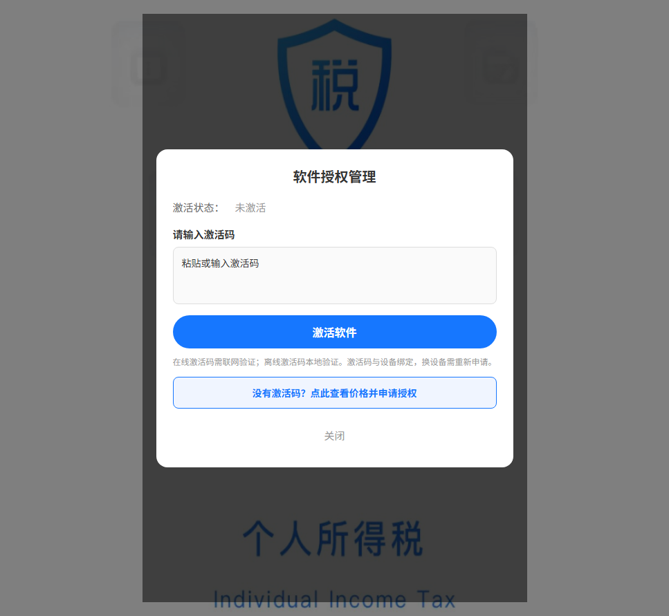
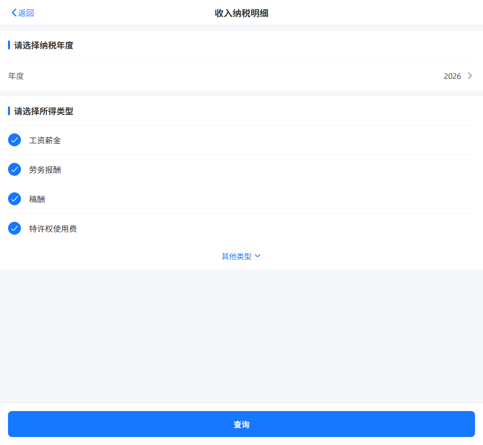
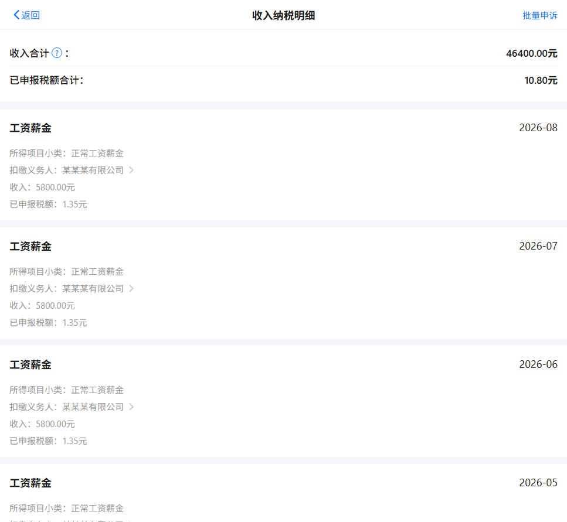
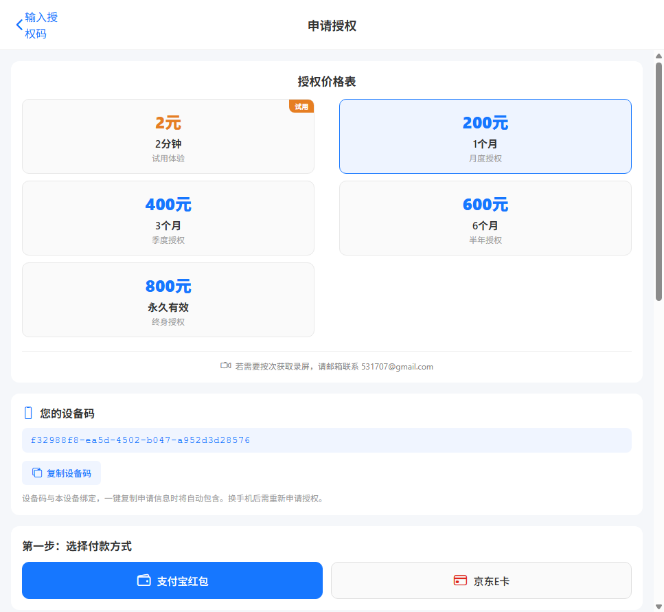

# 个人所得税 APP

高保真复刻的个税 APP 演示项目，基于 **Expo / React Native** 构建，支持本地离线运行。

**当前版本：v1.2.0**

## 📥 下载

**[⬇ 点击下载 Android APK v1.2.0 (111MB)](https://github.com/geshuiapp/geshui2026/releases/download/v1.2.0/geshui_v1.2.0.apk)**

> 下载后在手机上安装即可使用，无需联网服务器，所有数据存储在本地。

## 📖 使用说明书

**[📄 点击查看完整用户使用说明书](USER_GUIDE.md)**

内容包括：安装指南、激活流程、各页面操作说明、申请授权流程、常见问题与注意事项。

## 📝 更新日志

### v1.2.0
- 版本升级至 1.2.0
- 清理多余权限：移除麦克风和外部存储权限，避免安全软件误报
- 支持多红包码输入：400元套餐2个红包、600元3个、800元4个
- 新增防刷限制：同设备每天5次申请上限、同IP每天20次
- PushPlus微信通知：新申请即时推送
- 管理后台优化：多凭证显示、手机端适配

## ✨ 功能亮点

- 🏠 **首页**：搜索栏、温馨提示、年度汇算专题入口，截图底图高清渲染，支持上传替换与热区调整
- 📋 **收入纳税明细**：年度选择（2019–2026）、所得类型筛选、按月收入/税额明细卡片，长按可修改/复制/删除
- 👤 **我的页面**：登录前后双态，姓名与纳税人识别号按原图位置/字号/间距还原
- 🔑 **激活码授权**：启动页 2 秒过渡，在线/离线双模式激活，绑定设备、到期自动失效
- 🛡 **安全防护**：未激活全局拦截、30 秒智能授权检查、时间回退检测

## 📸 页面截图

| 页面 | 截图 |
|------|------|
| 启动页 |  |
| 激活面板 |  |
| 首页 |  |
| 我的 · 登录后 |  |
| 我的 · 未登录 |  |
| 登录页 |  |
| 收入纳税明细 · 筛选 |  |
| 收入纳税明细 · 结果 |  |
| 申请授权 |  |
| 关于 & 更新 |  |

## 💰 价格

| 时长 | 价格 |
|------|------|
| 试用 2 分钟 | 2 元 |
| 1 个月 | 200 元 |
| 3 个月 | 400 元 |
| 6 个月 | 600 元 |
| 永久有效 | 800 元 |
